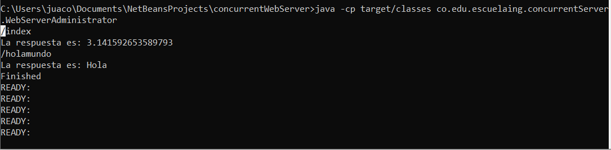
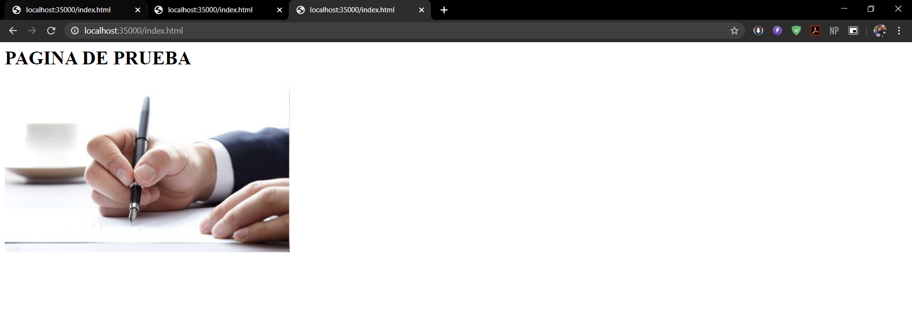
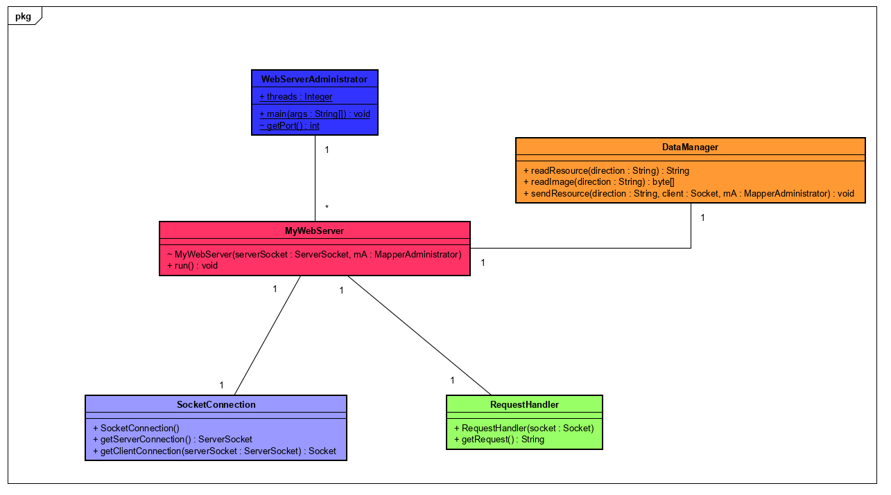
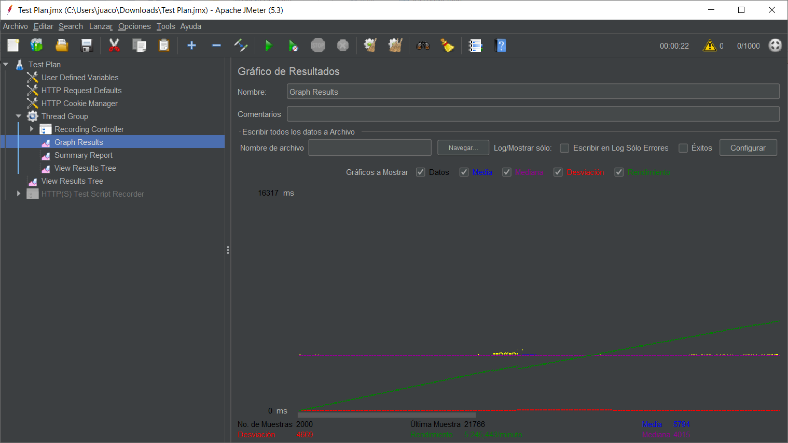
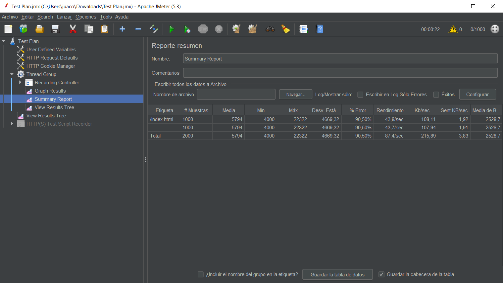
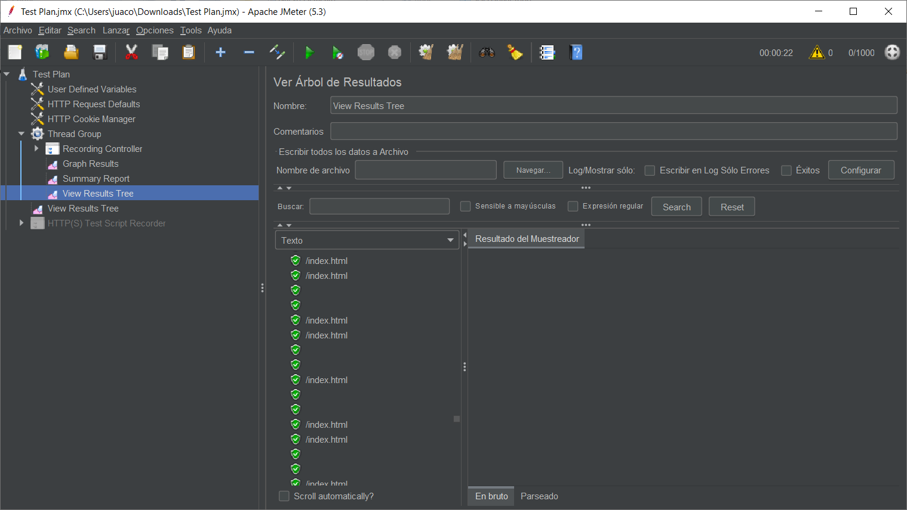

# HOMEWORK 3 ARSW (Concurrent Web Server)

Write a web server that supports multiple (concurrent) requests in a row. The server must return all requested files, including html pages and images.

# START

Copie el proyecto via git clone en cualquier diretorio para empezar a trabajar:
```
git clone https://github.com/Juaco9502/ServidorWebConcurrente-ARSW.git
```

## INSTALL

1. Run in terminal:

```
$$ mvn package
```

2.(Optional):
If you want to view the documentation of the application, execute the following command and check the following path: root / target:

```
mvn javadoc:javadoc
```

3. (Run):
The following command must be used in the project root folder:
  
```
java -cp target/classes co.edu.escuelaing.concurrentServer.WebServerAdministrator
```

### Execute

### Websites in browser

### GET


# Diagram


# TEST

### Compile GUI Jmeter:
```
mvn jmeter:configure jmeter:gui
```
### Graph Results


### Summary Report


### View Results Tree


## PRE-REQUISITES

* Java jdk > 7
* Maven (Apache Maven)
* Git
  

## BUILT

* [Maven](https://maven.apache.org/) - Dependency Management
* [JAVA JDK 8](http://www.oracle.com/technetwork/java/javase/overview/index.html) - Building
* [JUnit 3.8.1](https://mvnrepository.com/artifact/junit/junit/3.8.1) - Test


## AUTHOR

* **JUAN CAMILO ORTIZ MEDINA** - [Juaco9502](https://github.com/juaco9502)


## LICENSE

This project is licensed under the GNU General Public License - [LICENSE](LICENSE) 